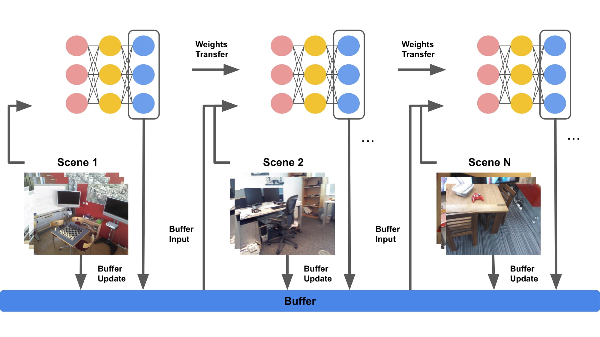

# [ICCV 2021] [Continual Learning for Image-Based Camera Localization](https://arxiv.org/pdf/2108.09112.pdf)
[Shuzhe Wang](https://ffrivera0.github.io/)\*, [Zakaria Laskar](https://scholar.google.com/citations?hl=en&user=kd3XIUkAAAAJ&view_op=list_works&sortby=pubdate)\*, [Iaroslav Melekhov](https://imelekhov.com/),  [Xiaotian Li](https://scholar.google.com/citations?user=lht2z_IAAAAJ&hl=en), [Juho Kannala](https://users.aalto.fi/~kannalj1/)

\* Equal Contribution 

This is the PyTorch implementation of our paper, [Continual Learning for Image-Based Camera Localization](https://arxiv.org/pdf/2108.09112.pdf). In this paper, we approach the problem of visual localization in a continual learning setup – whereby the model is trained on scenes in an incremental manner. Under this setting, all the scenes are not available during training but encountered sequentially. The results show that our method is memory efficient and has only slightly performance degradation compared to joint training.



## Setup
The environment is similar to [HSCNet](https://github.com/AaltoVision/hscnet). Python3 and the following packages are required:
```
cython
numpy
pytorch
opencv
tqdm
imgaug
```

It is recommended to use a conda environment:
1. Install anaconda or miniconda.
2. Create the environment: `conda env create -f environment.yml`.
3. Activate the environment: `conda activate hscnet`.

To run the evaluation script, you will need to build the cython module:

```bash
cd ./pnpransac
python setup.py build_ext --inplace
```


## Data

We run our experiments on  [7-Scenes](https://www.microsoft.com/en-us/research/project/rgb-d-dataset-7-scenes/), [12-Scenes](https://graphics.stanford.edu/projects/reloc/) and also 19-Scenes by combining the former scenes. To train/evaluate our code, you need to download the datasets from their website. We also need an additional  [data package](https://drive.google.com/drive/folders/19KyyoYy-2Nnc2Vu6yXGMvSJvo9Yfgfrh?usp=sharing) which contains other necessary files for reproducing our results.


## Evaluation

The trained models for ***Buff-CS*** sampling method with buffer size 256 and 1024 can be download [here](https://drive.google.com/drive/folders/1jYKRicvyq5-Jb81-s9NbcfFj7MqtMmAJ?usp=sharing). We will provide the model of other sampling methods soon.

To evaluate  our method:

```bash
python eval.py \
        --model hscnet \
        --dataset [i7S|i12S|i19S] \
        --scene scene_name \ # for i12S, use apt1/kitchen,apt1/living ...
        --checkpoint /path/to/saved/model/ \
        --data_path /path/to/data/
```


## Training 

You can train our continual setting network by running the following command:

```bash
python train.py \
        --model hscnet \
        --dataset [i7S|i12S|i19S] \
        --n_iter number_of_training_iterations # default 30000
        --data_path /path/to/data/
        --dense_pred [False|True] # False: train without dense representation
        --exp_name #set name to you experiments
        --buffer_size [128|256|512|1024]
        --sampling [Random|Imgbal|CoverageS]
```


## Acknowledgements

We appreciate the previous open-source repositories [DSAC++](https://github.com/vislearn/LessMore) and [HSCNet](https://github.com/AaltoVision/hscnet).


## License

Copyright (c) 2021 AaltoVision.  
This code is released under the [MIT License](LICENSE).


## Citation

Please consider citing our papers if you find this code useful for your research:  

```
@article{wang2021continual,
  title={Continual Learning for Image-Based Camera Localization},
  author={Wang, Shuzhe and Laskar, Zakaria and Melekhov, Iaroslav and Li, Xiaotian and Kannala, Juho},
  journal={arXiv preprint arXiv:2108.09112},
  year={2021}
}
```


